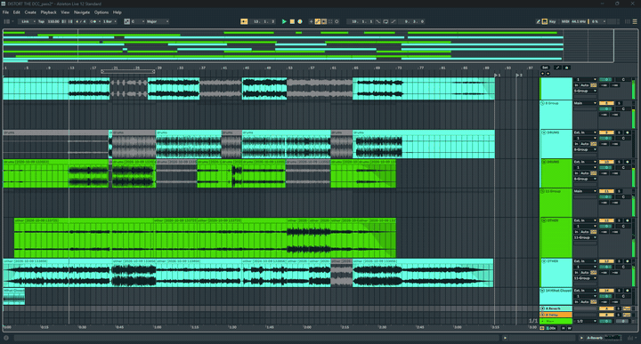
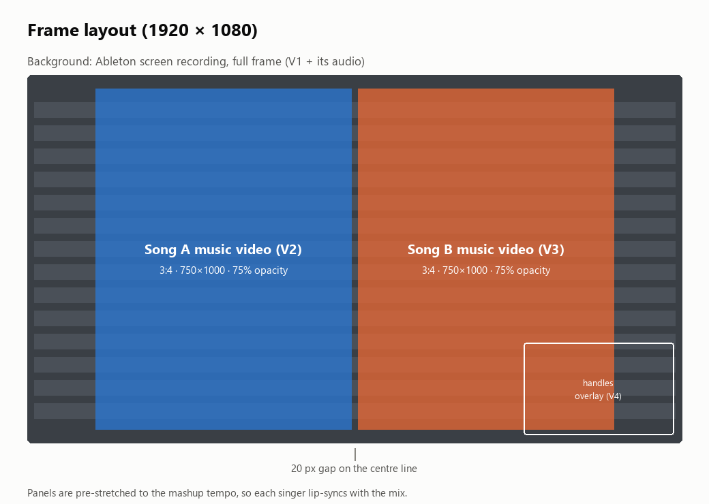
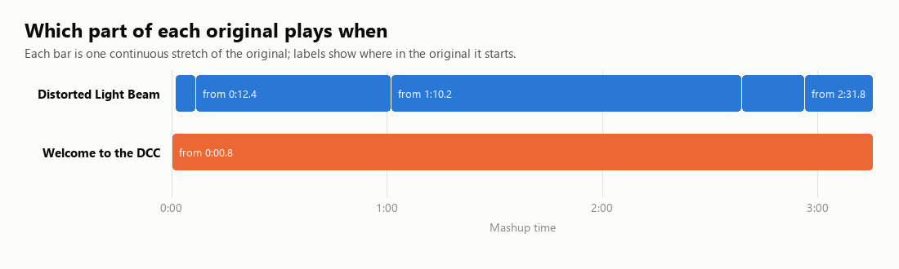

# music-video-editing

A Claude Code skill for music work on this pipeline: song mashups, stems,
tempo and key, and music videos built from an Ableton session. It is kept
separate from `stream-vod-edit`, which handles stream VODs, highlight edits
and shorts.

The main job it does: you record your Ableton session while the mashup plays,
and it works out which original song is playing at every moment, and from
where in that song. It then builds an editable DaVinci Resolve timeline with
both official music videos lip-synced on top of your session.

## What it can do

- Download a music video from the artist's channel and save an MP3 of it.
- Split a song into vocals, drums, bass and "other" stems (Demucs, on the GPU).
- Measure a song's exact tempo and its key.
- Answer Ableton questions: warping, quantize, stem lengths that don't match.
- Map a mashup back to its source songs, then build the music video in Resolve.
- Export the video for YouTube and write its upload metadata.
- Find official album and single covers, and make a deliberately bad
  "photoshop" mashup cover.

## How the mashup video is laid out

Your Ableton screen recording fills the frame and carries the audio. Each
music video sits on top as a 3:4 panel at 75% opacity, side by side with a
small gap on the centre line. Both panels are stretched to the mashup's tempo,
so each singer lines up with your mix.

## How the mapping works

1. The mashup audio from the recording is split into stems.
2. Every half-bar of the mashup is compared with every part of each original
   song, stem by stem. The original is stretched to the mashup tempo, and all
   12 pitch shifts are tried. The pitch shift that keeps matching shows how
   you transposed each song.
3. Each song gets its own track: one continuous position in the original that
   only jumps where your arrangement jumps. Each jump is then placed on the
   exact beat. Real jumps land on whole bars, which is a good sign the
   alignment is right.
4. The panels are cut at those jumps. A song you only muted and unmuted, never
   re-arranged, comes out as one clip for the whole video.

In the first mashup ("Distort the DCC"), DCC plays straight through. The
other song has a 3-bar skip, a 1-bar skip, and an 8-bar section that repeats
twice at the end.

## How-tos

Ask Claude in plain words; the skill picks up from there. Typical requests:

### Get a song and its stems

1. "Download the music video for *<song>* by *<artist>* and save an MP3."
   Claude searches YouTube, picks the upload from the artist's own channel, and
   saves the video and MP3 to your music folder.
2. "Split the stems." Four WAV stems (vocals, drums, bass, other), 24-bit,
   land in a `Stems/<Artist - Song>/` folder. They are all the same length, so
   they line up when dropped in at bar 1.

### Find the tempo and key

"What's the tempo and key of each?" The tempo is fitted through every beat of
the drum stem, so it's exact to two decimals, and each part of the song is
checked to confirm the tempo holds steady. Type that number into **Seg. BPM**
in Ableton. A rounded estimate drifts off the grid within a few bars.

### Turn an Ableton mashup into a music video

1. Record your Ableton screen while the mashup plays, and save the recording.
2. "Here's my mashup recording, use the two music videos for the visuals."
3. Claude shows the plan: tempo, key, which song plays where, and the layout.
   Change anything you like before it builds.
4. In Resolve, open a project and run **Workspace → Scripts → resolve_bridge**
   so Claude can reach it.
5. Claude builds the timeline: your recording plus its audio on V1, one panel
   track per song, and the handles overlay on top. Every clip stays trimmable.
6. Set **Project Settings → Master Settings → Playback frame rate** to match
   the timeline (the API can't set this one).

### Export for YouTube

"Export it with YouTube settings." The export uses Resolve's YouTube 1080p
preset, set explicitly to H.264 with AAC audio, and goes to a dated `EDITS`
folder. The output is checked for frame count and an audio stream.

### Album art

"Find the album art for both songs." Covers come from Apple Music's artwork
server at 3000×3000. Claude asks before downloading anything.

## Scripts

All of these live in `scripts/` inside this skill.

| Script | What it does |
|---|---|
| `match_mashup_sources.py` | Compares every half-bar of the mashup with each source song, stem by stem, at every pitch shift |
| `mashup_song_tracks.py` | One position track per song, with each jump placed on the exact beat |
| `mashup_segments.py` | Alternative view: one song at a time, whoever is singing (for a single-panel edit) |
| `build_mashup_clip_infos.py` | Turns the tracks into a Resolve clip list (recording, one panel track per song, overlay) |
| `resolve_build_timeline.py` | Builds the timeline over the Resolve bridge, adding the video tracks the layout needs |
| `bad_photoshop_cover.py` | The deliberately bad mashup cover; its crop points are specific to the first two covers |

## Requirements

- Windows, with an NVIDIA GPU for Demucs (CPU works, slowly).
- DaVinci Resolve free edition with the in-app bridge, as for the rest of this repo.
- `uv` for running yt-dlp and one-off Pillow scripts.
- A separate Python venv with CUDA PyTorch, Demucs and librosa. It's kept apart
  from the WhisperX venv so neither breaks the other.

## A note on copyright

Songs and music videos belong to the artists and their labels. Expect
Content ID claims if you upload a mashup that uses them. This repo holds no
audio, video or artwork from the source songs: only code, the analysis data
and the diagrams above.
