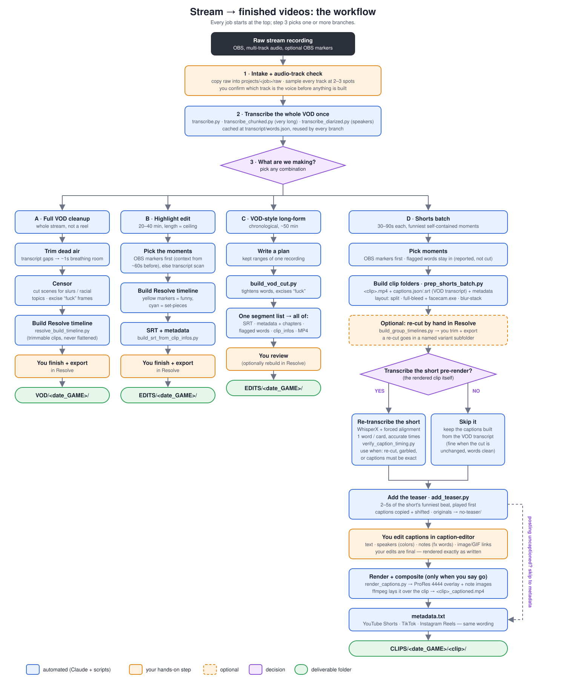

# video-editor

A personal pipeline for turning raw stream footage into finished, captioned
deliverables, driven end-to-end through Claude Code: a cleaned-up full VOD,
highlight edits, VOD-style long-forms, and vertical shorts for YouTube,
TikTok and Instagram.

Long-form cuts are never flattened inside Resolve. The cut is rebuilt as a
real, trimmable timeline, so it stays editable until you export it yourself.

**Companion repo:** [caption-editor](https://github.com/benjaminwellssss/caption-editor)
([Gitea mirror](https://git.onebynine.ai/ben/caption-editor)) is the local
browser app where you hand-edit a short's `captions.json` between this
pipeline building it and this pipeline rendering it. That covers text,
speakers, timing, overlapping-speech lanes, production notes and font. Its
README has its own step-by-step chart and how-tos.

Also as a PNG: [`docs/workflow.png`](docs/workflow.png).

## The common trunk (every job)

1. **Intake + audio-track check.** Copy the raw recording into
   `projects/<job>/raw/` (the original is never moved). Every audio track is
   sampled at two or three points across the recording, and **you confirm
   which track is the voice** before anything that depends on it is built.
   Two tracks can look like separate speakers and turn out to be the same
   full mix.
2. **Transcribe the whole VOD once.** WhisperX with word-level timestamps
   (CUDA float16, CPU int8 fallback), cached at
   `projects/<job>/transcript/words.json`. Every branch below reuses it.
   - `transcribe.py`: the normal case.
   - `transcribe_chunked.py`: very long recordings. It works in resumable
     30-minute chunks, and the partial output is usable while it runs.
   - `transcribe_diarized.py`: adds a speaker label to each word (for
     speaker-colored captions). Needs `HF_TOKEN`.
3. **Pick what you're making.** You can pick any combination of the four
   workflows below. A typical stream gets a VOD-style long-form plus a shorts
   batch.

## Workflow options

### A · Full VOD cleanup → `VOD/<MM-DD-YYYY_GAME>/`

This is the whole stream, tidied up, not a highlight reel.

- **Dead air:** trimmed by transcript gaps, with about 1s of breathing room
  kept on each side.
- **Censoring:** scenes with a named slur or a racial topic are cut. The word
  "fuck" is excised frame by frame, never muted. Other profanity is flagged
  only.
- **Timeline:** rebuilt as trimmable clips with `resolve_build_timeline.py`,
  or with the MCP's `create_timeline_from_clips`.

You finish and export it in Resolve.

### B · Highlight edit → `EDITS/<MM-DD-YYYY_GAME>/`

A curated 20–40 minute reel. A stated length is a ceiling, not a target.

- **Moment picking:** OBS markers come first. A marker lands *after* the
  funny moment, so the context is pulled from about 60s before it. Without
  markers, the transcript is scanned instead.
- **Timeline:** built in Resolve, with yellow markers for funny beats and
  cyan for set-pieces.
- **SRT:** comes straight from the cut list (`build_srt_from_clip_infos.py`,
  or `build_srt_multi_source.py` for multi-file timelines).

You finish and export it in Resolve.

### C · VOD-style long-form → `EDITS/<MM-DD-YYYY_GAME>/`

A chronological cut of one recording, typically about 50 minutes, built
without a Resolve round-trip.

You write a plan of kept ranges, and `build_vod_cut.py` tightens the dead
air between words and excises "fuck" variants at word level. It then
produces every deliverable from that one segment list:
- the SRT
- `metadata.txt` with chapters
- a flagged-word report
- Resolve `clip_infos` (if you want to finish in Resolve)
- the finished MP4

### D · Shorts batch → `CLIPS/<MM-DD-YYYY_GAME>/<clip>/`

Vertical 1080×1920 clips of 30–90 seconds, each a funny, self-contained
moment.

1. **Pick moments.** OBS markers come first. Flagged words stay in the clip:
   they get reported, and you censor them later.
2. **Build the clip folders** with `prep_shorts_batch.py <plan.json>`. Each
   clip gets its own folder containing `<clip>.mp4`, a single-word
   `captions.json` + `captions.srt` built from the VOD transcript, and
   `metadata.txt`. The layout options are:
   - split facecam/gameplay (`build_jumpcut_short.py`, `build_custom_crop_short.py`)
   - full-bleed gameplay with the facecam.exe window (`build_fullbleed_short.py`)
   - blur-stack (`build_blurstack_batch.py`)

   The social-handles overlay goes on by default. Dead stretches inside a
   short are jump-cut out.
3. **Optional: re-cut by hand.** `build_group_timelines.py` lays related
   shorts out on 16:9 Resolve timelines. You trim and export them yourself.
   A re-cut goes in a **named variant subfolder** (e.g. `mafia-bit-cut/`),
   never as a `_v2` file next to the original.
4. **Decide: transcribe the short pre-render, or not?** See the next
   section.
5. **Add the teaser.** Every short opens with 2–5 seconds of its funniest
   beat (the punchline or the big laugh), then plays from its normal start,
   so viewers get hooked.
   - `add_teaser.py <clip> --suggest` lists the loudest word-aligned
     windows as candidates.
   - `add_teaser.py <clip> <start> <end>` puts that window in front, snapped
     to word edges. It copies that window's captions to the front and shifts
     the rest. The pre-teaser files move to `no-teaser/`.
6. **Edit the captions** in the
   [caption editor](https://github.com/benjaminwellssss/caption-editor#how-tos).
   You can fix text, set speakers (each gets a fill color), write plain-English
   notes that drive effects, and paste image/GIF links. **Your edits are
   final:** they're rendered exactly as written.
7. **Render + composite**, only when you say so. `render_captions.py` renders
   a transparent ProRes 4444 overlay:
   - Note words (zoom, vibrate, red, progressively…) become effects through
     `caption_fx.py`.
   - Linked images are downloaded automatically and shown for the duration
     of their card.

   ffmpeg then lays the overlay over the clip, giving
   `<clip>_captioned.mp4`.
8. **Metadata.** `metadata.txt` has YouTube Shorts, TikTok and Instagram
   Reels sections. They use the same title, description and hashtags, not
   reworded per platform. The standard description (thanks for watching, an
   invite to the streams, handle links) is in the `stream-vod-edit` skill.

## Shorts: with or without a pre-render transcription

The captions `prep_shorts_batch.py` writes are cut out of the **full-VOD
transcript**. Sometimes that's enough, and sometimes the short needs its own
transcription.

| | **Skip it** (use VOD-transcript captions) | **Transcribe the short pre-render** |
|---|---|---|
| When | The short is cut exactly as planned, and the words in that window came out clean in the VOD transcript. | The short was re-cut by hand in Resolve. Or the VOD transcript is garbled or merged in that window. Or the captions have to be word-perfect. |
| What runs | Nothing extra. `captions.json` is already in the clip folder. | WhisperX on the **rendered short itself** (several passes; disputed words are scored with wav2vec2), then forced alignment to one word per card. Cards start 0.12s before the word and never overlap. Then `verify_caption_timing.py`, which checks each card against the audio. |
| Cost | Instant | A few minutes per short |
| Then | Caption editor → render | Caption editor → render |

A third option is to **post it uncaptioned**: skip the caption editor and
the render entirely and go straight to metadata.

For a short re-cut from a diarized base clip, `build_cards_from_ranges.py`
maps the base clip's words through Resolve's kept source ranges. It's a
cheaper middle ground when the base transcript was already good.

## Repo layout

- `scripts/`: standalone Python/ffmpeg tooling.

  | Area | Scripts |
  |---|---|
  | Transcription | `transcribe.py`, `transcribe_chunked.py`, `transcribe_diarized.py` |
  | Long-form cuts | `build_vod_cut.py`, `build_scene_cut.py`, `resolve_build_timeline.py` |
  | SRT builders | `build_srt_from_cut.py`, `build_srt_from_clip_infos.py`, `build_srt_multi_source.py`, `build_srt_from_cards.py` |
  | Shorts | `prep_shorts_batch.py`, `verify_shorts_batch.py`, `build_jumpcut_short.py`, `build_custom_crop_short.py`, `build_fullbleed_short.py`, `build_blurstack_batch.py`, `build_group_timelines.py`, `remap_words_jumpcut.py`, `add_teaser.py` |
  | Caption cards | `build_caption_cards.py`, `build_short_cards_from_segments.py`, `build_sentence_emphasis_cards.py`, `build_speaker_cards.py`, `build_speaker_colors.py`, `build_cards_from_ranges.py` |
  | Rendering | `render_captions.py`, `caption_fx.py`, `render_handle.py`, `render_facecam_frame.py`, `render_static_caption.py`, `render_disclaimer_card.py`, `build_shake_zoom_punch.py` |
  | Checks | `verify_caption_timing.py`, `verify_shorts_batch.py` |

- `.claude/skills/`: Claude Code skills. `stream-vod-edit` is the
  authoritative reference for this pipeline; it covers:
  - audio-track identification and censoring tiers
  - short layouts and crop numbers
  - deliverable folder rules
  - the metadata spec

  The HyperFrames motion-graphics authoring skills live here too.
- `docs/`: the workflow flowchart (`workflow.svg`, `workflow.png`).
- `vendor/`: cloned third-party dependencies (DaVinci Resolve MCP server,
  HyperFrames engine). Not edited here and not tracked.
- `assets/fonts/`: caption typefaces. Bebas Neue is the house style; four
  heavier faces were picked for small-size mobile legibility (Montserrat
  Black, Anton, Archivo Black, Poppins ExtraBold).
- `projects/<job>/{raw,transcript,graphics,outputs}/`: per-job working
  directories. Footage and renders are git-ignored.

## Captions

`render_captions.py` renders animated, word-level pop-in captions as a
transparent overlay from a `captions.json` card list, usually one you have
just edited in [caption-editor](https://github.com/benjaminwellssss/caption-editor).
Its README has a writer's cheat sheet for the note words below.

Card fields:
- `start`, `end`, `lines`
- `fill`: speaker color
- `lane`: simultaneous captions; lane 0 is the main caption, and further
  lanes stack under it
- `note`

Per-card **notes** are written in plain English, and `caption_fx.py` turns
them into effects:
- grow/zoom, shake/vibrate, dance, glow, color
- intensity words (*gentle* → *violent*/*max*)
- image/GIF overlays with a placement grid
- cross-card ramps ("progressively more intense")
- find-and-apply-everywhere ("make all instances of 'X' shake")
- a persisting text-position toggle ("under my face", "centered again")

A note the renderer doesn't understand is never silently dropped. It's
reported so a person can handle it (or a one-off driver script renders it).

The caption font is chosen per job in the editor's Font dropdown and saved
in the job's speakers sidecar file. `render_captions.py` picks it up
automatically.

## Deliverable folders

Everything finished lands in the deliverables folder, which has four subfolders:

| Folder | Holds |
|---|---|
| `VOD/` | Cleaned full-length streams |
| `EDITS/` | Highlight edits and VOD-style long-forms (+ SRT, metadata) |
| `CLIPS/` | One folder per short: `<clip>.mp4`, `captions.json`, `captions.srt`, `metadata.txt`, `<clip>_captioned.mp4` |
| `RESOLVE/` | Resolve project backups |

Batch folders are named `MM-DD-YYYY_GAME`, using the recording date.

## Environment

Windows with an NVIDIA GPU, running DaVinci Resolve 21.0.x **free edition**.
External scripting is Studio-only, so this repo reaches Resolve through its
in-app bridge script (Workspace → Scripts → resolve_bridge). Other machine
notes:
- Set `PYTHONUTF8=1` for piped scripts.
- ffmpeg 8+ needs `-/filter_complex <file>` (`-filter_complex_script` is
  gone).
- Read the clip FPS from Resolve, not ffprobe.

Machine-specific notes live in a local, untracked `CLAUDE.md`. The
`stream-vod-edit` skill carries the rest.
